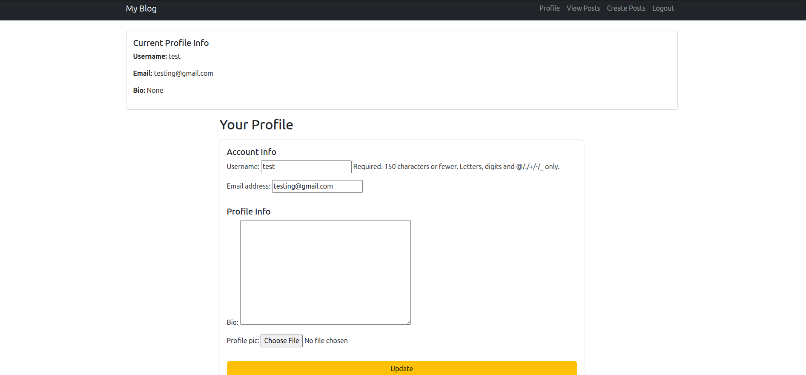

# 📝 Django Blog Application

A simple **Django Blog App** with authentication and CRUD functionality.  
Users can register, log in, edit their profiles, and create, read, update, or delete blog posts.  

The project also includes a **REST API** built with **Django REST Framework (DRF)**.

## ✨ Features

- 🔑 **User Authentication**
  - Register, Login, Logout
  - Profile page with update functionality
- 📝 **Blog Posts**
  - List all posts (public)
  - View post details (public)
  - Create, edit, and delete posts (author only)
- 🌐 **REST API**
  - Endpoints for listing, retrieving, creating, updating, and deleting posts
  - Token-based authentication for API access
- 🎨 **Bootstrap Styling** for a clean UI

---

## 📂 Project Structure

django_blog/
│── blog/ # Blog app (models, views, templates, urls)
│── users/ # User app (profiles, forms, views, urls)
│── django_blog/ # Project settings and config
│── templates/ # Base templates
│── static/ # Static files (CSS, JS, Images)
│── manage.py

## API Endpoints(DRF)
| Method | Endpoint           | Description                 |
| ------ | ------------------ | --------------------------- |
| GET    | `/api/posts/`      | List all posts              |
| GET    | `/api/posts/<id>/` | Retrieve single post        |
| POST   | `/api/posts/`      | Create new post (auth only) |
| PUT    | `/api/posts/<id>/` | Update post (author only)   |
| DELETE | `/api/posts/<id>/` | Delete post (author only)   |

### Screenshots

### Profile Page

